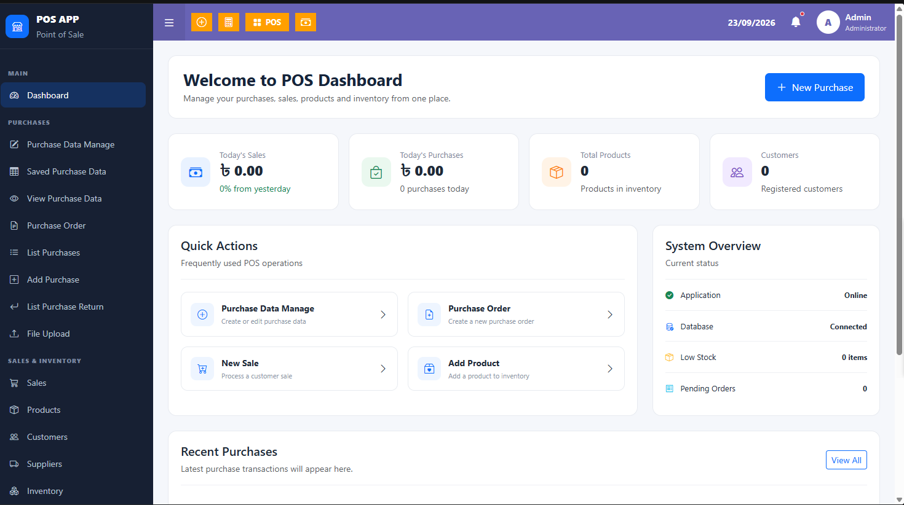
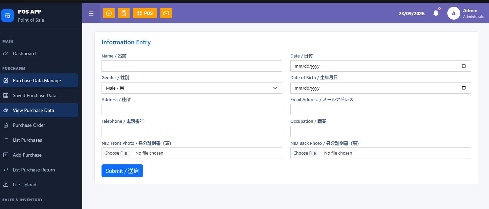
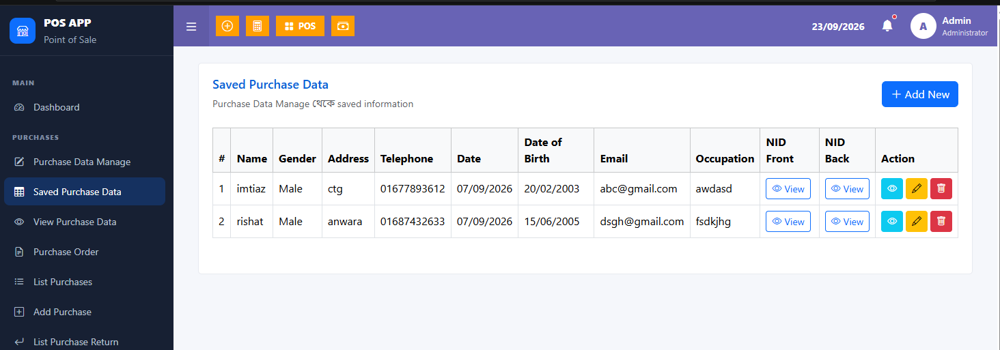
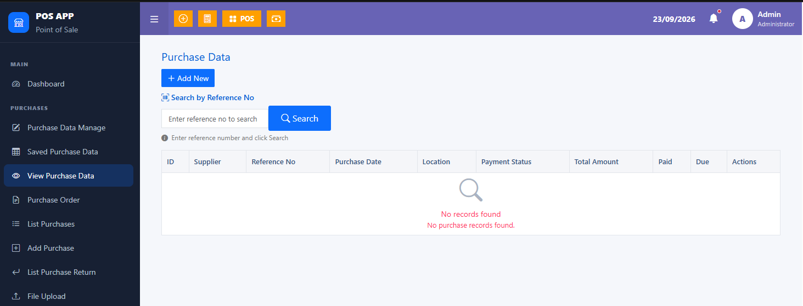
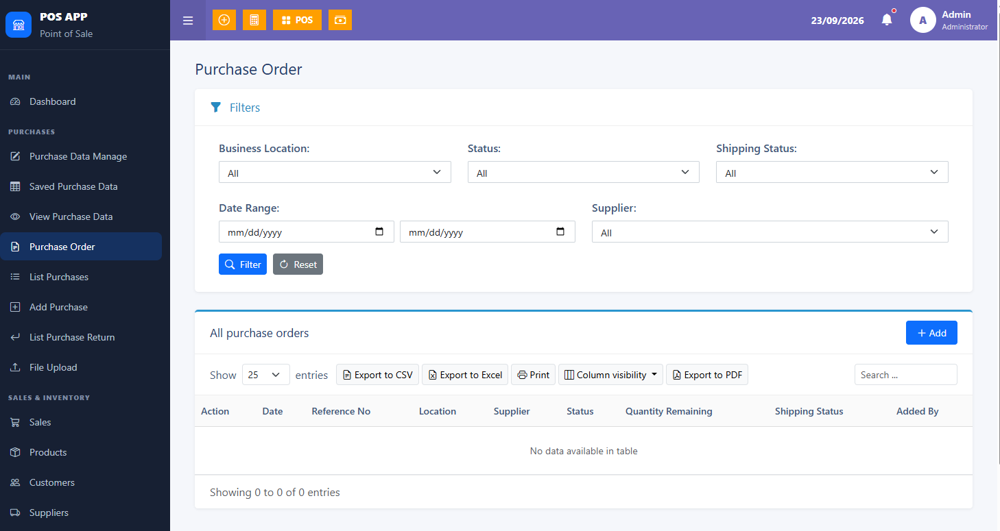
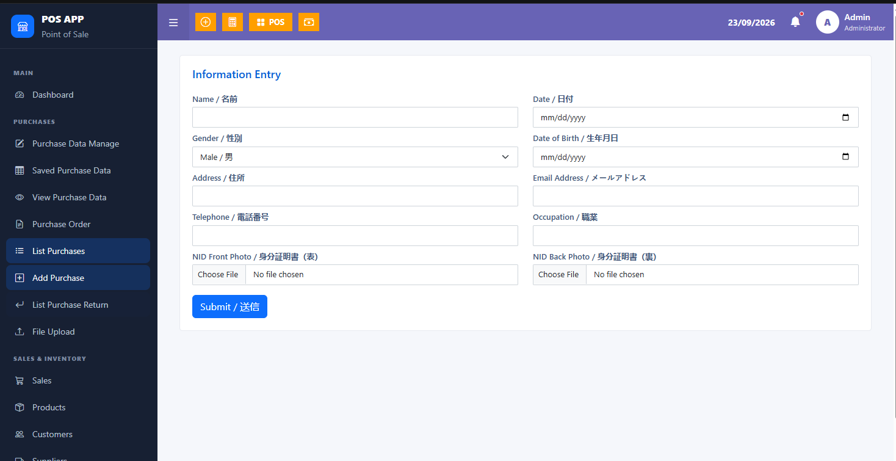

# POS Management System

A web-based **Point of Sale (POS) Management System** developed using **Laravel, PHP, Blade, Bootstrap, JavaScript, and MySQL**.

The project is developed by recreating the required interface and functionality of the existing **POS360 web application (`pos.japan365.co`)**. Screenshots and the existing system were used as references to understand the layout, navigation, forms, tables, purchase management workflow, and other required functionalities.

The system includes the **Home Dashboard** and the first three Purchase modules with frontend, backend, database integration, CRUD operations, validation, file upload, search, filtering, printing, column visibility, and export functionality.

---

## Project Overview

The main objective of this project is to recreate and implement selected POS360 functionalities as an independent Laravel application.

### Implemented Areas

- Home Dashboard
- Purchase Data Manage
- View Purchase Data
- Purchase Order
- Saved Purchase Data
- Add Purchase

The project follows the **Laravel MVC architecture** and uses **MySQL** for persistent data storage.

---

## Reference System

The existing **POS360 web application (`pos.japan365.co`)** was used as the primary design and functionality reference.

Screenshots of the existing system were captured and analyzed to recreate:

- Dashboard layout
- Sidebar navigation
- Top navigation bar
- Purchase management pages
- Information entry forms
- Data tables
- Search functionality
- Filtering system
- Dropdown menus
- Action buttons
- Purchase order interface
- Print interface
- Column visibility controls
- CSV/Excel/PDF export interfaces

The application was independently implemented using Laravel rather than modifying the original POS360 system.

---

# Technology Stack

## Frontend

- HTML5
- CSS3
- Bootstrap
- JavaScript
- Blade Template Engine

## Backend

- PHP
- Laravel Framework
- Laravel MVC Architecture
- Eloquent ORM

## Database

- MySQL
- Laravel Migrations
- Database CRUD Operations

## Development Tools

- Visual Studio Code
- Composer
- Git
- GitHub
- XAMPP
- PHP

---

# Implemented Modules

The POS Management System currently includes the following implemented modules and interfaces:

### 1. Home Dashboard
- POS application dashboard
- Navigation sidebar and top navigation
- Sales and purchase summary cards
- Total products and customer overview
- Quick action section
- System status overview
- Recent purchases section
- New Purchase shortcut

### 2. Purchase Data Manage
- Purchase/customer information entry form
- Name and gender
- Address and telephone
- Date and date of birth
- Email and occupation
- NID front and back photo upload
- Form validation
- MySQL database integration
- Submit and save functionality

### 3. Saved Purchase Data
- Display saved purchase/customer records
- Tabular data presentation
- View NID front and back documents
- View saved information
- Edit existing records
- Delete records
- Add new purchase data
- Database-driven records

### 4. View Purchase Data
- Purchase data listing
- Search by reference number
- Purchase ID
- Supplier information
- Reference number
- Purchase date
- Location
- Payment status
- Total amount
- Paid and due amount
- Action controls
- Empty-state handling when no records are available

### 5. Purchase Order
- Purchase order management interface
- Business location filter
- Order status filter
- Shipping status filter
- Date range filtering
- Supplier filtering
- Search functionality
- Reset filters
- Purchase order table
- Add purchase order
- CSV export
- Excel export
- PDF export
- Print functionality
- Column visibility control
- Pagination / entries control

### 6. Add Purchase
- Purchase information entry interface
- Customer/purchase information form
- Date and date of birth
- Gender selection
- Address and contact information
- Email and occupation
- NID front and back document upload
- Submit functionality
- Laravel backend integration

---

## Application Screenshots

### 1. Home Dashboard

The Home Dashboard provides an overview of the POS system, including sales, purchases, products, customers, quick actions, system status, and recent purchases.

---

### 2. Purchase Data Manage

The Purchase Data Manage page provides an information entry form for managing purchase/customer-related information, including personal details, contact information, date information, and NID documents.

---

### 3. Saved Purchase Data

The Saved Purchase Data page displays previously stored records in a table with options to view NID documents, view records, edit information, and delete records.

---

### 4. View Purchase Data

The View Purchase Data page provides purchase record management with reference-number search, supplier information, purchase date, payment status, total amount, paid amount, and due amount.

---

### 5. Purchase Order

The Purchase Order page provides filtering by business location, status, shipping status, date range, and supplier. It also includes search, export, print, column visibility, and purchase order management functionality.

---

### 6. Add Purchase

The Add Purchase page provides a purchase information entry interface with customer details, date information, contact information, occupation, and NID document upload functionality.